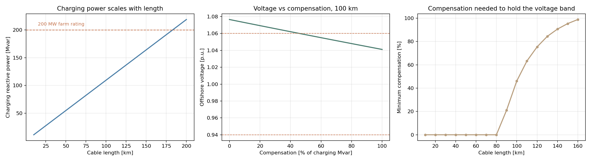

# Project 02: HVAC export cable for an offshore wind farm

**Tools:** pandapower, Python, matplotlib
**Data:** pandapower standard line type `N2XS(FL)2Y 1x300 RM/35 64/110 kV`, parameters
traced to Heuck, Dettmann and Schulz (2013) p.744
**Notebook:** [Project2.ipynb](./Project2.ipynb)
**Status:** complete

---

## The question

How much shunt reactive compensation does a 110 kV AC export cable need to connect a
200 MW offshore wind farm, and at what distance does the AC option stop working?

## What this does

Builds a two bus pandapower model of an offshore wind farm connected to shore by parallel
110 kV XLPE submarine circuits. Sweeps cable length from 10 km to 200 km. At each length
it finds, by bisection, the smallest amount of shunt reactive compensation that keeps the
offshore voltage inside 0.94 to 1.06 per unit and the circuits below their thermal rating.

A long AC cable is a large distributed capacitance. It generates reactive power even at
no load, and that reactive current occupies conductor capacity and raises the offshore
voltage. Beyond some length no amount of shunt compensation fixes it. This study finds
that length for one specific design.

## Results

| Metric | Value |
|--------|-------|
| Cable | `N2XS(FL)2Y 1x300 RM/35 64/110 kV` |
| R, X, C | 0.06 ohm/km, 0.144 ohm/km, 144.0 nF/km |
| Single circuit rating | 112.0 MVA |
| Circuits required for 200 MW | 2 |
| Charging power at 50 km | 54.7 Mvar |
| Charging power at 100 km | 109.5 Mvar (55 percent of farm rating) |
| Charging power at 200 km | 219.0 Mvar |
| No compensation needed up to | 80 km |
| Compensation at 100 km | 46 percent (50.5 Mvar) |
| **Longest feasible AC length** | **160 km** |

**Key finding.** The connection needs no compensation out to 80 km.
The requirement then climbs steeply and reaches full compensation at
160 km. Beyond that the offshore voltage leaves the band even with
the charging power completely cancelled, because what remains is series impedance rather
than shunt capacitance. That is where HVDC stops being an alternative and becomes the only
option.

**Second finding.** Compensation reduces losses as well as voltage. At 100 km, losses fall
from 9.42 MW to 9.07 MW and circuit
loading falls from 95.2 percent to 90.2 percent.
Shunt reactors free thermal capacity by removing reactive current from the conductor.



## Limitations

The 160 km figure is specific to this design and should not be quoted
as a general crossover distance.

- Only 110 kV is studied. Real export systems often use 220 kV or higher, which roughly
  halves the current and extends the AC range.
- The farm operates at unity power factor. Turbine converters can provide reactive support.
- Compensation is split evenly between the two ends, which Zhu et al. (2015) show is not optimal.
- No mid cable compensation platform, which is the standard way to extend AC reach.
- No cost modelling. The real technology choice is economic.

For context, Zhu, Dui and Zhang (2015) state in their abstract that HVAC is preferred
within 40 km of shore. This study reaches further because the circuits are lightly loaded
and therefore have spare capacity for charging current.

## Files

```
02_offshore_wind/
├── Project2.ipynb              main notebook
├── src/cable_study.py          the same analysis as a script
└── results/
    ├── p02_summary.json        headline numbers
    ├── p02_length_sweep.csv    uncompensated case vs length
    ├── p02_compensation_sweep.csv  voltage vs compensation at 100 km
    ├── p02_min_compensation.csv    minimum compensation per length
    └── p02_results.png
```

## How to run

```bash
pip install -r ../requirements.txt
jupyter notebook Project2.ipynb
```

No API keys and no downloads. All input data ships with pandapower.

## References

1. Thurner, L. et al. (2018). "pandapower: An Open-Source Python Tool for Convenient
   Modeling, Analysis, and Optimization of Electric Power Systems." *IEEE Transactions on
   Power Systems*, 33(6), 6510 to 6521. DOI: 10.1109/TPWRS.2018.2829021
2. Heuck, K., Dettmann, K.-D., and Schulz, D. (2013). *Elektrische Energieversorgung*,
   9th ed. Springer Vieweg. DOI: 10.1007/978-3-8348-2174-4
3. Zhu, G., Dui, X., and Zhang, C. (2015). "Optimisation of reactive power compensation of
   HVAC cable in off-shore wind power plant." *IET Renewable Power Generation*, 9(7),
   857 to 863. DOI: 10.1049/iet-rpg.2014.0375
4. Dakic, J. et al. (2021). "HVAC Transmission System for Offshore Wind Power Plants
   Including Mid-Cable Reactive Power Compensation." *IEEE Transactions on Power Delivery*,
   36(5), 2814 to 2824. DOI: 10.1109/TPWRD.2020.3027356
5. Rahman, S. et al. (2021). "A Comparison Review on Transmission Mode for Onshore
   Integration of Offshore Wind Farms: HVDC or HVAC." *Electronics*, 10(12), 1489.
   DOI: 10.3390/electronics10121489
6. CIGRE WG B1.40 (2015). *Offshore generation cable connections.* Technical Brochure 610.
