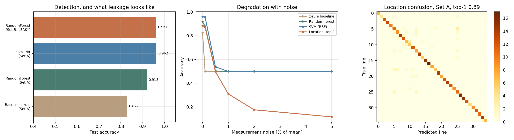

# Project 03: detecting and locating line outages from bus measurements

**Tools:** scikit-learn, pandapower, Python
**Data:** synthetic, generated on the IEEE 39-bus New England network (Athay, Podmore and
Virmani, 1979) as shipped with pandapower
**Notebook:** [Project3.ipynb](./Project3.ipynb)
**Status:** complete

---

## The question

Can a classifier detect that a transmission line has tripped, and identify which one, from
bus voltage measurements alone? And does it survive realistic measurement noise?

## What this does

Generates 2800 power flow solutions on the IEEE 39-bus network,
1400 healthy and 1400 with one of 35 lines out of
service, with loads randomised by 10 percent. Trains a statistical baseline, a random
forest and an SVM to detect the outage, and a second random forest to identify which line.
Then adds measurement noise and watches what happens.

## The leakage problem, kept visible on purpose

My first version scored almost perfectly and taught me nothing. I had included line power
flows in the features, and a line that is out of service reports no flow, so the feature
vector pointed straight at the answer.

The notebook keeps both feature sets so the difference is measurable:

- **Set B**, 113 features including line flows. Leaky.
- **Set A**, 78 bus voltage magnitudes and angles. The honest problem.

All headline numbers below use Set A.

## Results

### Detection

| Model | Features | Test accuracy |
|---|---|---|
| Baseline, voltage z-rule (k=3) | 78 | 0.827 |
| Random forest | 78 | 0.918 |
| **SVM, RBF kernel** | 78 | **0.962** |
| Random forest on leaky Set B | 113 | 0.961 |

Random forest 5-fold cross validation on the training set: 0.917 plus or minus
0.013, consistent with the 0.918 test score, so the model is not
overfitting.

### Location, 35 classes

| Metric | Set A | Set B (leaky) |
|---|---|---|
| Top-1 accuracy | 0.886 | 0.986 |
| Top-3 accuracy | 0.945 | |

Random guessing would give 2.9 percent.

### Noise sensitivity

| Noise | Baseline | Random forest | SVM | Location |
|---|---|---|---|---|
| 0 percent | 0.827 | 0.918 | 0.962 | 0.886 |
| 1 percent | 0.500 | 0.500 | 0.500 | 0.309 |
| 5 percent | 0.500 | 0.500 | 0.500 | 0.117 |

**Key finding, and it is negative.** Every model collapses to chance at 0.5 percent
measurement noise. The classifiers are keying on very small voltage differences, because
removing one line from a well meshed network at moderate loading barely moves the bus
voltages. The signal is smaller than realistic instrument error.

The honest conclusion is that 0.962 on clean simulated data says almost nothing
about whether this would work on a real system. That is the most useful thing this project
taught me.

**A smaller surprise.** Leakage helps location a great deal (0.986 against
0.886) but barely helps detection at all. Noticing that something changed is
easy either way. Working out what changed is where the shortcut pays off.



## Limitations

- Synthetic data, one network, one topology.
- Line outages only. No short circuits, no generator trips.
- Load variation is spatially independent, which real load is not.
- Snapshots rather than time series.
- Gaussian noise is a crude model of instrument error.

## Files

```
03_fault_detection/
├── Project3.ipynb
├── src/
│   ├── generate_dataset.py     scenario generation, runs in chunks
│   └── train_evaluate.py       baseline, models, noise study
└── results/
    ├── p03_dataset.npz         the generated dataset
    ├── p03_summary.json        headline numbers
    ├── p03_baseline.csv        baseline threshold tuning
    ├── p03_detection.csv       model comparison
    ├── p03_noise.csv           noise sensitivity
    └── p03_results.png
```

## How to run

```bash
pip install -r ../requirements.txt
python src/generate_dataset.py 500 0     # repeat with different seed offsets to grow the set
python src/train_evaluate.py
```

No API keys and no downloads. The network ships with pandapower.

## References

1. Athay, T., Podmore, R., and Virmani, S. (1979). "A Practical Method for the Direct
   Analysis of Transient Stability." *IEEE Transactions on Power Apparatus and Systems*,
   PAS-98(2), 573 to 584. DOI: 10.1109/TPAS.1979.319407
2. Illinois Center for a Smarter Electric Grid. "IEEE 39-Bus System."
   https://icseg.iti.illinois.edu/ieee-39-bus-system/
3. Thurner, L. et al. (2018). "pandapower." *IEEE Transactions on Power Systems*, 33(6),
   6510 to 6521. DOI: 10.1109/TPWRS.2018.2829021
4. Mohammadi Shakiba, F., Azizi, S. M., Zhou, M., and Abusorrah, A. (2023). "Application of
   machine learning methods in fault detection and classification of power transmission
   lines: a survey." *Artificial Intelligence Review*, 56, 5799 to 5836.
   DOI: 10.1007/s10462-022-10296-0
5. Rafique, F., Fu, L., and Mai, R. (2021). "End to end machine learning for fault detection
   and classification in power transmission lines." *Electric Power Systems Research*, 199,
   107430. DOI: 10.1016/j.epsr.2021.107430
6. Pedregosa, F. et al. (2011). "Scikit-learn: Machine Learning in Python." *JMLR*, 12,
   2825 to 2830.
