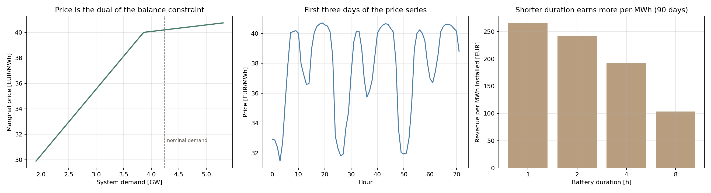

# Project 04: where the price comes from, and what a battery is worth

**Tools:** NumPy, SciPy (linprog), pandapower, matplotlib
**Data:** IEEE 118-bus generator cost data (Christie, 1993) as shipped with pandapower
**Notebook:** [Project4.ipynb](./Project4.ipynb)
**Status:** complete

---

## The question

Electricity prices are the dual variables of a constrained optimisation. Can I demonstrate
that from published cost data rather than take it on trust, and then use the resulting
prices to work out what a battery is worth?

## What this does

Most battery studies begin by downloading a price series. This one begins a level lower.

1. Solves economic dispatch on the IEEE 118-bus quadratic cost curves by lambda iteration.
2. Verifies numerically that the multiplier equals the derivative of system cost with
   respect to demand.
3. Builds an hourly price series by pushing a daily demand profile through that dispatch.
4. Optimises battery arbitrage against those prices as a linear program.
5. Reports sensitivities, because the demand profile is an assumption.

## Results

### The duality result, verified

| Check | Value |
|---|---|
| Price at nominal demand (4242 MW) | 40.196 EUR/MWh |
| Max abs(marginal cost minus lambda) over dispatched units | 0.0e+00 |
| Numerical dCost/dDemand | 40.1961 EUR/MWh |

The multiplier and the numerical derivative agree to four decimal places. That is the
theoretical content of nodal pricing demonstrated on real published data rather than
asserted.

### Price series

2160 hours, mean 37.51 EUR/MWh, range 30.36 to 41.0,
standard deviation 3.07.

### Battery duration, 50 MW power rating, 90 days

| Duration | Energy | Revenue | Revenue per MWh installed | Cycles |
|---|---|---|---|---|
| 1 h | 50 | 13,265 | 265.3 | 83.2 |
| 2 h | 100 | 24,278 | 242.8 | 82.8 |
| 4 h | 200 | 38,404 | 192.0 | 81.3 |
| 8 h | 400 | 41,410 | 103.5 | 47.2 |

**Key finding.** Revenue per MWh of installed energy falls as duration rises. A 1 hour
battery earns the most per MWh installed because it can capture the single best spread each
day and cycle fully, while a longer battery has to reach into shallower parts of the price
curve to fill itself. That points the opposite way from the intuition that bigger is better,
and it is the kind of result a developer would actually act on.

### Does forecasting matter?

| Case | Revenue over 89 days |
|---|---|
| Perfect foresight | 24,121 EUR |
| Naive persistence (yesterday's prices) | 22,508 EUR |
| **Foresight premium** | **6.7 percent** |

Smaller than I expected, and it is a property of my assumed profile rather than of batteries.
My daily shape repeats closely, so yesterday is an excellent forecast of today. In a real
market with weather driven renewables the day to day shape varies far more and the premium
would be much larger.

### Volatility sensitivity, 4 hour battery, 30 days

| Profile amplitude | Price std dev | Spread | Revenue |
|---|---|---|---|
| 0.50 | 1.01 | 5.16 | 0 |
| 0.75 | 1.22 | 5.73 | 0 |
| 1.00 | 1.46 | 6.30 | 4 |
| 1.50 | 1.96 | 7.45 | 322 |
| 2.00 | 2.47 | 8.78 | 3,596 |

**The most useful finding in the project.** Below an amplitude of about
0.75, revenue is exactly zero. Not small, zero.

With a round trip efficiency of 0.846 the battery only earns anything if the ratio between
its selling price and its buying price exceeds 1.181. Below that the
optimiser correctly refuses to trade at all. A battery business case is therefore not
proportional to average price, or even to price standard deviation. It depends on whether
the spread clears a hard efficiency barrier, and under that barrier the asset earns nothing
from arbitrage regardless of its size.



## Limitations

- The daily demand profile is assumed, not measured. This is the weakest input and every
  conclusion that leans on it is reported as a sensitivity.
- The IEEE 118-bus system is heavily over capacitated (9161 MW of
  generation against 4242 MW of demand), so prices move much less than in
  a real tight market. No scarcity pricing is possible here.
- Single bus, so no network constraints and no locational price differences.
- Day ahead arbitrage only. No balancing, frequency response or capacity revenue. In the
  Nordic system reserve revenue often exceeds arbitrage revenue.
- No degradation cost, so the model cycles more freely than an operator would.
- Price taker assumption, reasonable for 50 MW in a 4 GW system.

## Files

```
04_storage_optimizer/
├── Project4.ipynb
├── src/dispatch_and_battery.py
└── results/
    ├── p04_summary.json          headline numbers
    ├── p04_price_vs_demand.csv   the merit order response
    ├── p04_prices.csv            the hourly price series
    ├── p04_duration.csv          duration scan
    ├── p04_volatility.csv        volatility sensitivity
    └── p04_results.png
```

## How to run

```bash
pip install -r ../requirements.txt
jupyter notebook Project4.ipynb
```

No API keys and no downloads. The cost data ships with pandapower.

## References

1. Kirschen, D. S., and Strbac, G. (2019). *Fundamentals of Power System Economics*,
   2nd ed. Wiley. ISBN 9781119213246.
2. Bohn, R. E., Caramanis, M. C., and Schweppe, F. C. (1984). "Optimal Pricing in Electrical
   Networks over Space and Time." *The RAND Journal of Economics*, 15(3), 360 to 376.
   DOI: 10.2307/2555444
3. Schweppe, F. C. et al. (1988). *Spot Pricing of Electricity.* Kluwer. ISBN 0-89838-260-2.
4. Christie, R. (1993). "118 Bus Power Flow Test Case." University of Washington.
   https://labs.ece.uw.edu/pstca/pf118/pg_tca118bus.htm
5. Thurner, L. et al. (2018). "pandapower." *IEEE Transactions on Power Systems*, 33(6),
   6510 to 6521. DOI: 10.1109/TPWRS.2018.2829021
6. Virtanen, P. et al. (2020). "SciPy 1.0." *Nature Methods*, 17, 261 to 272.
   DOI: 10.1038/s41592-019-0686-2
