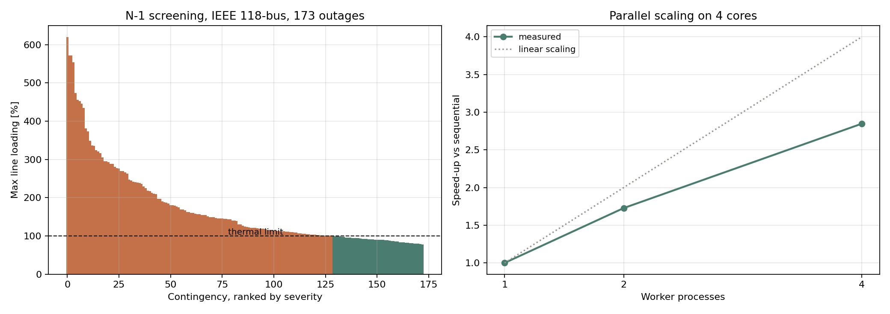

# Project 05: a parallel N-1 contingency screening toolkit

**Tools:** pandapower, Python, concurrent.futures
**Data:** IEEE 118-bus test case (Christie, 1993) as shipped with pandapower
**Notebook:** [Project5.ipynb](./Project5.ipynb)
**Status:** complete

---

## The question

N-1 screening is embarrassingly parallel, since every contingency is independent. How much
speed-up does that actually deliver, and how do I prove the parallel version returns exactly
the same answers as the sequential one?

## What this does

The first four projects are studies. This one is a tool. It provides a `ContingencyAnalyzer`
class that takes a pandapower network, removes each line in turn, re-solves AC power flow,
records thermal and voltage violations, and restores the line. It runs either sequentially
or across worker processes, and it verifies that the two paths agree before reporting timings.

N-1 security is the underlying requirement in both major reliability frameworks. In Europe
the (N-1) criterion is defined in Commission Regulation (EU) 2017/1485, Article 3. In North
America the planning equivalent is NERC TPL-001.

## The modelling assumption, stated up front

The University of Washington archive is explicit that the line MVA limits in the 118-bus case
were not part of the original 1962 AEP data and were made up. With pandapower's defaults the
base case peaks at 4.5 percent loading, so nothing ever violates and screening is pointless.

I derive ratings as 1.3 times the base case current with a floor, which puts the base case at
76.92 percent. Every violation count below depends on that choice. The
timing results, which are the actual subject of the project, do not.

## Results

### Screening, IEEE 118-bus

| Metric | Value |
|---|---|
| Buses, lines, transformers, generators | 118, 173, 13, 53 |
| Total load | 4242 MW |
| Base case max loading | 76.92 percent |
| Base case voltage range | 0.943 to 1.05 p.u. |
| Contingencies screened | 173 |
| Converged | 173 of 173 |
| With thermal violations | 129 |
| With voltage violations | 12 |
| Worst case | line 46 at 619.3 percent |

### Parallel scaling, 4 cores

| Workers | Runtime | Speed-up | Runtime reduction |
|---|---|---|---|
| 1 (sequential) | 4.90 s | 1.00x | 0 percent |
| 2 | 2.83 s | 1.73x | 42.1 percent |
| 4 | 1.72 s | 2.85x | 64.9 percent |

**2.85x speed-up on 4 cores, a 64.9 percent runtime reduction, with
results verified identical to the sequential run.**

**Key finding.** Scaling is sub-linear, 2.85x rather than 4x. Process startup, pickling
the network out to each worker and collecting results back are fixed costs that do not shrink
with more cores, and on a problem this small they are a visible fraction of the total. The
gap between 2.85x and 4x is the interesting part, not the speed-up itself.

Two implementation details were necessary and neither is obvious:

1. The worker function must be defined at module level. `ProcessPoolExecutor` pickles it to
   send it to a subprocess, and a bound method or a closure fails with an error that does not
   point at the cause.
2. The network is passed once per worker through an initialiser, not once per task. Sending a
   copy with each of the 173 tasks costs more in serialisation than the power
   flow costs to solve.



## Limitations

- Line outages only. Generator and transformer contingencies are the obvious extension.
- AC power flow for every case. Production tools run a fast DC pre-screen and only solve AC
  for marginal cases, which is a far larger saving than parallelism.
- Derived thermal ratings, as described above.
- Only four cores. The interesting scaling questions begin at 32 or more.
- No N-1-1 or common mode outages.

## Files

```
05_contingency_toolkit/
├── Project5.ipynb
├── src/contingency.py                 ContingencyAnalyzer class
└── results/
    ├── p05_summary.json               headline numbers and timings
    ├── p05_contingency_118bus.csv     full results, ranked by severity
    └── p05_results.png
```

## How to run

```bash
pip install -r ../requirements.txt
jupyter notebook Project5.ipynb
```

or use it directly:

```python
from src.contingency import ContingencyAnalyzer, build_net
results, runtime = ContingencyAnalyzer(build_net()).screen(parallel=True, workers=4)
print(results.sort_values("max_loading", ascending=False).head())
```

No API keys and no downloads. The network ships with pandapower.

## References

1. Christie, R. (1993). "118 Bus Power Flow Test Case." Power Systems Test Case Archive,
   University of Washington. https://labs.ece.uw.edu/pstca/pf118/pg_tca118bus.htm
2. Thurner, L. et al. (2018). "pandapower." *IEEE Transactions on Power Systems*, 33(6),
   6510 to 6521. DOI: 10.1109/TPWRS.2018.2829021
3. Commission Regulation (EU) 2017/1485 of 2 August 2017 establishing a guideline on
   electricity transmission system operation. *Official Journal of the European Union.*
   https://eur-lex.europa.eu/eli/reg/2017/1485/oj/eng
4. NERC. "TPL-001-5.1: Transmission System Planning Performance Requirements."
   https://www.nerc.com/globalassets/standards/reliability-standards/tpl/tpl-001-5.1.pdf
5. Illinois Center for a Smarter Electric Grid. "IEEE 118-Bus System."
   https://icseg.iti.illinois.edu/ieee-118-bus-system/
